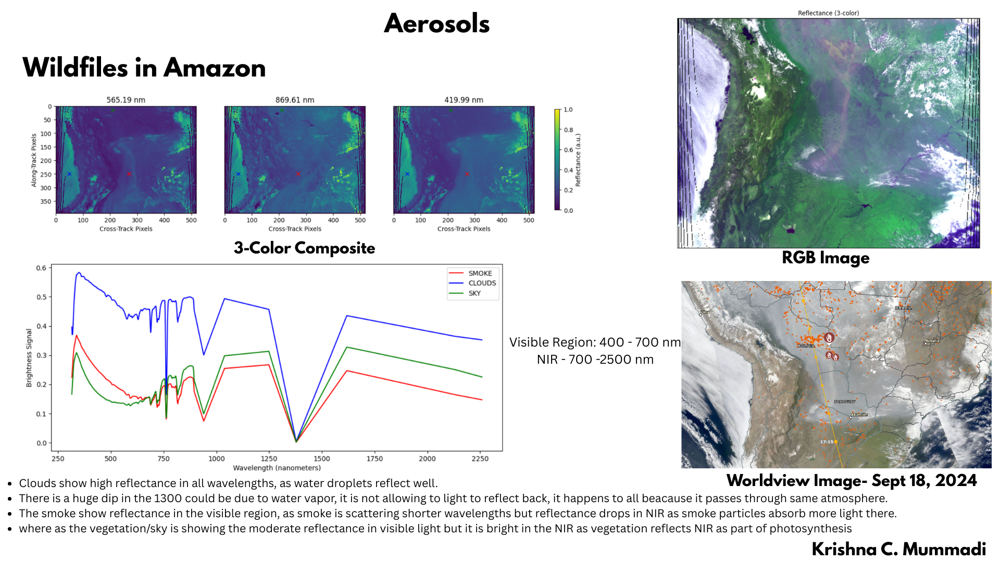

# Relectance using Pace data

# Satellite Imagery & Analysis with PACE OCI

This project demonstrates how to load, explore, and visualize **NASA PACE/OCI** Level-1C data in Python/Jupyter. You’ll open a NetCDF file, browse metadata, plot single-band images and RGB composites, inspect pixel spectra, project imagery on a map, and compute simple indices.

> Notebook: `SatelliteImagery_PACE-OCI_Projects.ipynb`

---

## Features

* Open PACE/OCI NetCDF (`.nc`) files with **netCDF4**
* Inspect dataset groups/variables and wavelengths
* Plot per-band images and a 3-band **RGB composite**
* Extract and plot **spectra** from selected pixels
* **Map projection** with Cartopy (lat/lon)

---

## Process

### 1) Get the data

Place a PACE/OCI Level-1C file in (or adjust path inside the notebook):

```
../data/PACE_OCI.20240918T171411.L1C.V3.5km.nc
nc
```

### 2) Environment setup 

#### pip 

```bash
# Windows (Command Prompt or PowerShell)
py -m pip install --upgrade pip
pip install jupyterlab numpy matplotlib netCDF4 cartopy pyproj shapely
```


### 3) Launch Jupyter

```bash
# from your project folder
py -m jupyter lab
```

Open `SatelliteImagery_PACE-OCI_Projects.ipynb`.

---

## How the Notebook is Organized

1. **Imports / Setup**
   Uses: `numpy`, `matplotlib`, `netCDF4`, `cartopy` (+ `ccrs`), plus small utility functions:

   * `reflectance(rad, sza, f0)` — converts radiance to reflectance:

     $$
     \text{reflectance} = \frac{\pi \cdot \text{radiance}}{\cos(\text{sza}) \cdot F_0}
     $$
   * `color3_make(ch1, ch2, ch3)` — builds 3-band color composites.

2. **Loading an Image**
   Opens the NetCDF dataset and explores groups/variables, e.g.:

   * `/geolocation_data/longitude`, `/geolocation_data/latitude`
   * `/sensor_views_bands/intensity_wavelength`
   * radiance arrays and attributes

3. **Wavelengths & Radiances**
   Lists available wavelengths, selects bands, and sets display ranges.
   
   

5. **Plotting**

   * Single-band quicklooks
   * **RGB composite** (choose 3 bands → visualize)

6. **Pixel Spectra**
   Select pixel(s) by (x, y) and plot spectrum across wavelengths.
   
7. **Map Projection**
   Uses Cartopy with lat/lon to render georeferenced imagery
   

---

## Helpful insights

* **Pick bands** thoughtfully for RGB (e.g., a red-ish, green-ish, and blue-ish channel).
* If imagery looks blown out, **adjust radiance/reflectance scales** in the plotting cells.
* For **pixel spectra**, verify `(row, col)` order and tilt/indexing match your array shapes.
* For **map plots**, ensure your latitude/longitude arrays have the same spatial shape as your imagery.

---


---

📑 [View the full presentation (PDF)](WildfilesinAmazon.pdf)

---

## Acknowledgments

* I would like to thank Brent Mcbride, Post Doc at UMBC for helping me with the code and analysis.
* Open-source Python ecosystem: NumPy, Matplotlib, netCDF4, Cartopy

